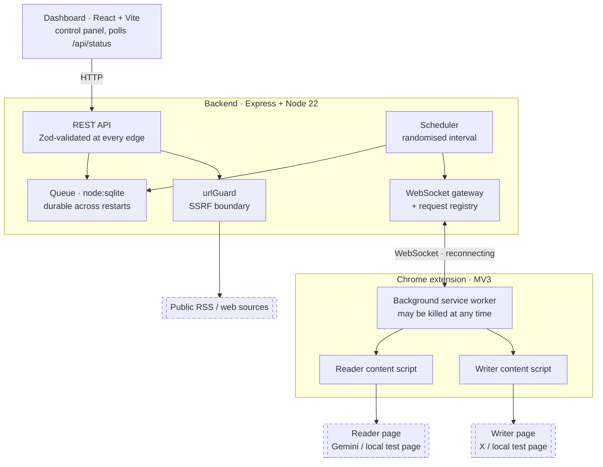
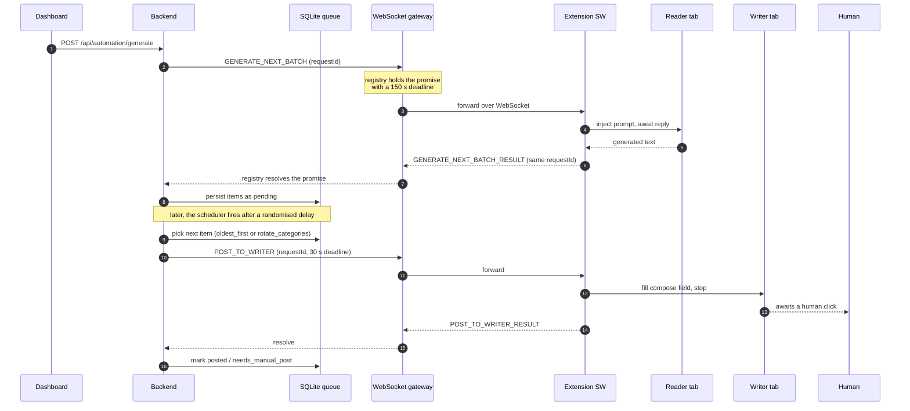

# Local Browser Automation Bridge

[](https://github.com/atj393/local-browser-automation-bridge/actions/workflows/ci.yml)
[](LICENSE)
[](tsconfig.base.json)
[](package.json)
[](#testing)

A local prototype that connects two independent browser websites using a
Chrome extension, a local backend, a dashboard, a SQLite queue, and a
WebSocket bridge, without modifying either website.

The reference flow uses **Gemini** as the LLM source ("reader") and
**X (Twitter)** as the posting target ("writer"), but it works against any
two pages by adjusting selectors. Local test pages are bundled so the whole
demo runs offline without touching real services.

---

## ⚠️ Safety note

This repository is a **local proof-of-concept**, not a production posting
or scraping product.

- **Auto-submit is disabled by default.** The writer content script fills
  the compose field and stops. You manually click *Post*.
- For real websites such as X.com, keep auto-submit off and review every
  generated post before sending.
- Use this only with **accounts and pages you own or have permission to
  test against**.
- Do **not** use this for spam, fake engagement, scraping abuse,
  rate-limit evasion, or to bypass any platform's terms of service.
- Selectors and DOM probing exist for resilience against minor UI changes.
  Production integrations should use official APIs instead.

---

## Project status

- **Source:** open source under **MIT**, version `0.1.0`, a working prototype.
- **Distribution:** none. There is no published package and no hosted service. Everything runs on localhost.
- **Stack:** pnpm monorepo, TypeScript throughout, Express backend, `node:sqlite` queue, `ws` gateway, React and Vite dashboard, Manifest V3 extension.
- **CI:** every push and pull request runs typecheck, 56 unit tests, and a build of all four workspace packages.

---

## Architecture

Four processes that cannot call each other directly: a React dashboard, a Node
backend, a Chrome service worker, and content scripts inside pages nobody here
controls. Everything below is a consequence of that.



Dashed nodes are pages and services this project does not control. Everything
inside the solid boxes runs on localhost.

### One job, end to end



If the extension disconnects at any point, `rejectAll` settles every in-flight
promise instead of leaving the dashboard waiting forever.

### Why these choices

**Why WebSockets?** The backend needs to *initiate* work in a browser tab. HTTP
runs the wrong way for that: the extension would have to poll, which means
either latency or wasted requests, and there is no clean way to stream stage
progress back. A socket also gives a free liveness signal. If it drops, the
reader and writer tabs are gone, and the UI can say so immediately rather than
after a timeout.

**Why SQLite (`node:sqlite`)?** The queue must survive a backend restart. Items
already generated represent real LLM work, and losing them on a crash is the one
unacceptable failure. SQLite gives durability and transactions in a single file
with no service to run, and Node 22's built-in module means zero native
dependencies to compile. A hosted database would be infrastructure for something
that is explicitly local-only.

**Why a shared contracts package?** Four processes, three of them unable to share
memory, all exchanging the same message shapes. `@lbab/shared` holds the message
types and constants so a change to a payload is a compile error everywhere at
once rather than a runtime `undefined` in whichever process was not updated.
This is the whole reason the project is a monorepo.

**Why a request registry?** WebSockets have no request and response semantics. The
registry maps a `requestId` to a pending promise with a deadline, so the REST
handler can `await` something that will be answered by a browser tab, or time
out, or be rejected because the socket died.

### Failure modes

Every one of these is reachable in normal use, so each has a defined behaviour
rather than a hang.

| Failure | What happens |
|---|---|
| Extension disconnects mid-request | `rejectAll` settles all in-flight promises with a disconnect error, and the dashboard reports it instead of spinning |
| Reader tab closed or never opened | Request fails fast with a message naming the tab to open, rather than waiting out the timeout |
| Reader never answers | Registry deadline fires (150 s generate, 30 s post) and rejects |
| Duplicate reply after a reconnect | `resolve()` returns `false` for an already-settled id, and the late answer is ignored |
| Backend restarts | Queue survives in SQLite. The in-memory scheduler does not, and resumes on next start |
| Writer selectors change | DOM probe fails, and the item moves to `needs_manual_post` for manual handling |
| Source URL redirects to a private host | Re-validated after redirect and rejected |
| Malformed JSON in a stored row | `safeParse` returns `null`, so one bad row cannot crash the scheduler |

### Security boundaries

- **SSRF guard on every fetched URL.** `urlGuard.ts` is a dependency-free module
  applied to user-supplied source URLs *and again after redirects*. It rejects
  non-HTTP schemes, loopback, RFC1918 ranges, IPv6 link-local, and `169.254.0.0/16`,
  which includes the cloud instance-metadata address. 24 tests cover it.
- **Bounded ingestion.** Fetches are capped by timeout and byte ceiling, and
  extracted text is truncated before it reaches the queue.
- **Localhost only, no auth.** The backend binds to localhost and has no
  authentication. That is a deliberate local-prototype trade-off, and the reason
  it must not be exposed to a network. See [Known limitations](#known-limitations).
- **No credentials handled.** The extension drives tabs the user has already
  signed into. It never sees, stores, or transmits a password or token.
- **Human in the loop.** Auto-submit is off by default, and the writer stops at a
  filled field.

---

## What is included

```
local-browser-automation-bridge/
├── apps/
│   ├── backend/      Express + node:sqlite + WebSocket gateway + scheduler
│   ├── dashboard/    React + Vite control panel (status, settings, queue, logs)
│   └── extension/    Manifest V3 Chrome extension (CRXJS)
└── packages/
    └── shared/       Shared types, contracts, constants
```

The backend also serves two **local test pages** that emulate the real
reader and writer DOMs so you can run the demo without ever opening Gemini or X:

- `http://localhost:4000/test/llm` emulates Gemini and replies with valid
  10-item JSON one second after Send.
- `http://localhost:4000/test/writer` emulates an X composer and feed.

---

## Tech stack

- **pnpm** workspace (monorepo)
- **TypeScript** end to end
- **Node.js** and **Express** for the backend
- **`node:sqlite`** (built-in, no native compilation) for the queue
- **`ws`** for the WebSocket gateway
- **React** and **Vite** for the dashboard
- **Chrome Manifest V3** and **`@crxjs/vite-plugin`** for the extension
- **Zod** for input validation

---

## Quick start

**Requirements**

- **Node.js 22.5+ recommended, 24.x verified.** The backend uses Node's
  built-in `node:sqlite`, which is stable in Node 24 and gated behind
  `--experimental-sqlite` on Node 22.5 to 22.x. An `ExperimentalWarning` may
  print on boot, and is harmless.
- **pnpm 9+**.
- **Google Chrome or Chromium**, any recent version with MV3 support.
- **Localhost only.** The backend binds to `127.0.0.1:4000`. No remote
  configuration is needed.

**Install and run**

```bash
pnpm install

pnpm dev              # all three in parallel
# or, in three terminals:
pnpm dev:backend      # http://localhost:4000
pnpm dev:dashboard    # http://localhost:5173
pnpm dev:extension    # builds to apps/extension/dist (watch mode)
```

**Load the extension**

1. Open `chrome://extensions` in Chrome.
2. Toggle **Developer mode** on, top-right.
3. Click **Load unpacked**.
4. Select `apps/extension/dist`.

> After rebuilding the extension, click the **reload** icon on the extension
> in `chrome://extensions` and **refresh** any open reader or writer tabs so
> their content scripts pick up the new build.

**Run the offline demo**

Open the dashboard at `http://localhost:5173`, plus the two bundled test pages
at `http://localhost:4000/test/llm` and `http://localhost:4000/test/writer`,
then click **Generate next batch now** followed by **Post next item now**. No
Gemini or X account is involved.

The full walkthrough, including content-source configuration, the posting
schedule, the manual fallback, troubleshooting, and the backend API surface,
is in the [operations guide](docs/operations.md).

---

## Testing

**56 unit tests across 5 files**, run on every push and pull request by
[CI](https://github.com/atj393/local-browser-automation-bridge/actions/workflows/ci.yml)
alongside `pnpm typecheck` and `pnpm build`.

| Suite | Tests | What it pins down |
|---|---|---|
| `urlGuard` | 24 | The SSRF boundary: scheme allow-list, loopback, RFC1918, IPv6 link-local, cloud metadata, and that public `172.32+` is *not* over-blocked |
| `requestRegistry` | 10 | Request and response over a socket that has neither: resolve, reject, timeout, duplicate replies after a reconnect, and `rejectAll` on disconnect leaving no stray timers |
| `queueService` | 9 | Category rotation, so never two of a kind in a row, age order preserved within a category, nothing dropped or duplicated |
| `safeJson` | 7 | A malformed stored row returns `null` instead of taking down the scheduler, and circular and BigInt values do not throw |
| `randomDelay` | 6 | Scheduler delays stay inside the window and never go negative or sub-second, including on inverted input |

The suite is deliberately pure: `node:sqlite` is aliased to a stub that throws,
so a test that quietly starts depending on a real database fails loudly rather
than opening a file. That keeps the unit tests fast and deterministic.

**Not covered:** live Gemini or X.com runs (the bundled local test pages exist
for that, exercised by hand), real WebSocket transport, and DOM selector
resilience against real sites. Selectors are the thing most likely to break and
the least meaningful to unit test.

```bash
pnpm test        # what CI runs
pnpm test:watch
```

---

## Development commands

```bash
pnpm typecheck         # TypeScript across all 4 workspace packages
pnpm test              # Vitest unit tests (what CI runs)
pnpm test:watch        # Vitest in watch mode
pnpm build             # Build all
pnpm build:backend     # tsc --noEmit (backend runs via tsx)
pnpm build:dashboard   # tsc --noEmit + vite build
pnpm build:extension   # vite build (CRXJS) -> apps/extension/dist
```

Built outputs (`dist/`, `apps/*/dist/`) and runtime data
(`apps/backend/data/*.sqlite*`) are generated and not committed.
`pnpm-lock.yaml` is committed for reproducible installs.

---

## Known limitations

- Real websites can change DOM selectors. `selectors.ts` is the single
  source of truth for all DOM probes.
- The extension only acts on tabs that are currently open.
- The scheduler is single-process and in-memory, so a backend restart resets it.
- The dashboard polls `/api/status` every 2 s. There is no dashboard WebSocket yet.
- No authentication on the local backend, which binds to localhost only.
- `node:sqlite` prints an `ExperimentalWarning` on boot, which is harmless.
- Icons are 1×1 placeholder PNGs.
- Not production-ready. For production, use the platform's official API.

---

## Implementation notes

How the pieces fit together:

- **Manifest V3 background service worker** declared via
  `defineManifest` from `@crxjs/vite-plugin`. Vite and TypeScript build
  an unpacked extension to `apps/extension/dist`.
- **Two content scripts**, one per role: a *reader* matching the LLM
  pages and a *writer* matching the posting pages. Each is guarded by
  a `window.__loaded__` flag to survive duplicate injection.
- **`CONTENT_READY` handshake.** When a content script loads, it
  registers its `chrome.runtime.onMessage` listener *before* anything
  async, then notifies the background service worker. Only after this
  handshake is a tab considered "ready" in the background's tab registry.
- **`PING_CONTENT` liveness check.** Before dispatching a heavy
  command, the background round-trips a synchronous ping to confirm
  the content script's listener is still attached. This avoids the
  classic `Receiving end does not exist` failure mode.
- **WebSocket bridge** between the extension's background service worker and the
  local backend. Messages are matched by `requestId` with explicit
  per-type timeouts: 150 s for batch generation, 30 s for writes.
- **Local SQLite queue** via Node's built-in `node:sqlite` holds the
  generated post items, their statuses, and an append-only log table.
  Stale runtime fields (`is_running`, `next_run_at`, `posting` rows)
  are reset on backend startup.
- **Dashboard-driven control flow.** All actions originate from the
  React dashboard. The scheduler in the backend is single-process and
  in-memory, and the extension is a passive executor.
- **Reliable input insertion.** Native value setter for
  `<textarea>` and `<input>`, plus `execCommand('insertText')` and
  `InputEvent` dispatch for `contenteditable` elements, with a
  `textContent` fallback. This makes framework-controlled inputs
  in React, Vue, and similar actually fire their `input` and `change` handlers.
- **Selector fallbacks.** Each role has an ordered list of
  selectors. Specific matches are tried first, broad fallbacks
  (`main`, `body`) are used only when nothing else returns text, and a
  warning is logged when they do.

---

## Documentation

- [Operations guide](docs/operations.md): content sources, posting schedule, manual fallback, troubleshooting, backend API summary.
- [CONTRIBUTING.md](CONTRIBUTING.md): install, run, branch naming, and the safety rules above.
- [SECURITY.md](SECURITY.md): how to report vulnerabilities.

## License

[MIT](LICENSE).
